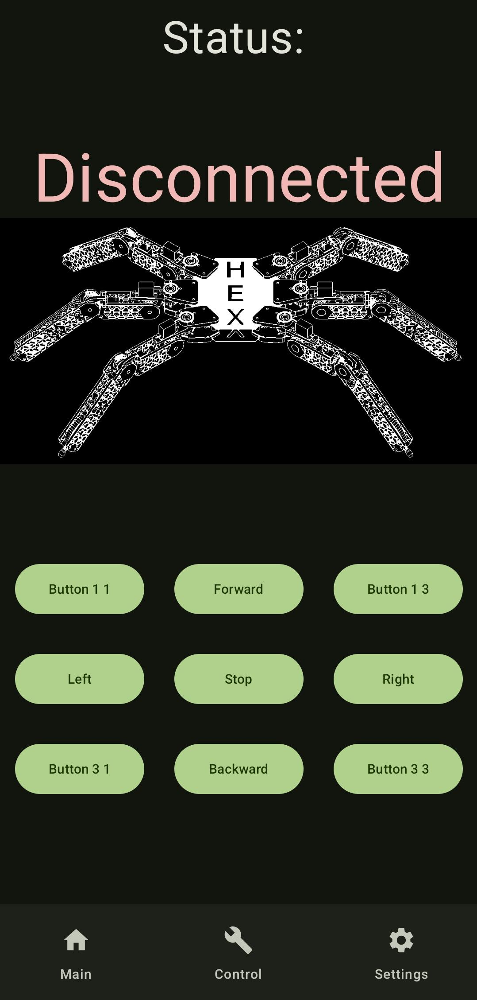
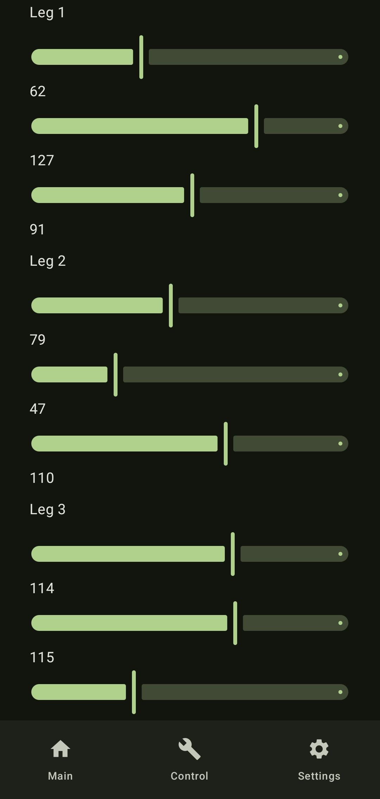
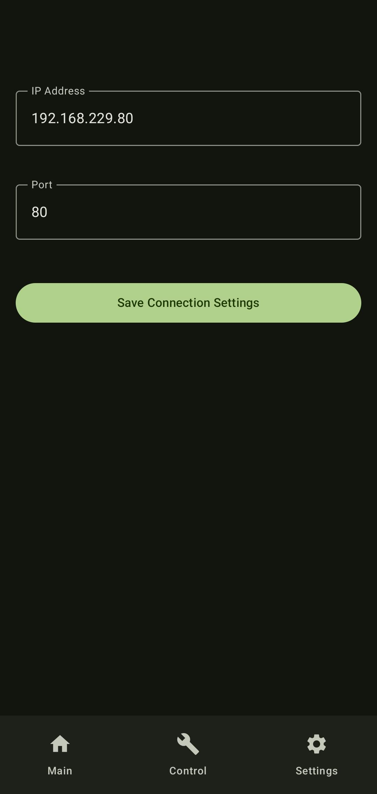

# Hexapod App

An Android application that allows you to remotely control a hexapod robot via WebSocket.

## Features

- **Servo control**: Set the position of 18 servos using sliders.
- **WebSocket connection**: Configurable server IP address and port.
- **Connection status**: Displays the current connection status with the robot.
- **Main panel**: Quick status overview and movement control buttons.
- **Settings panel**: Edit the WebSocket server IP address and port.

## Screenshots

<p align="center">
  
  
  
</p>

## Requirements

- Android 7.0 (API 24) or newer
- Connection to the local network where the hexapod server is running

## Technologies

- Jetpack Compose
- OkHttp WebSocket
- Material 3

## WebSocket Configuration

You can change the server IP address and port in the **Settings** tab of the app or directly in `WebSocketHandler.kt`:

```kotlin
private var IP = "192.168.229.80"
private var PORT = 80
```

Main repository: https://github.com/Siedmiu/Hexapod